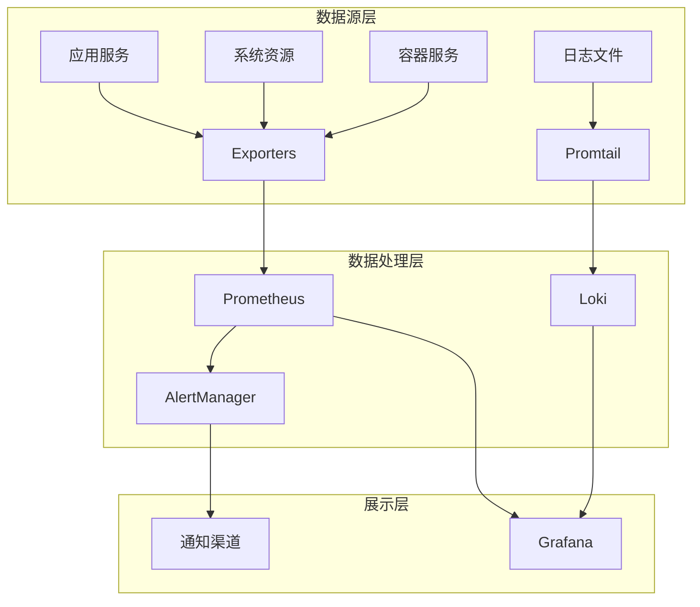

# 在线时间工具 - 运维监控系统总结

## 项目概述

在线时间工具现已配备完整的运维监控功能，确保应用在生产环境中的高可用性、可观测性和可维护性。本系统集成了现代化的监控栈，提供全方位的系统洞察和自动化运维能力。

## 🎯 核心能力

### 1. 全栈监控覆盖
- ✅ **应用层监控**: HTTP请求、响应时间、错误率、业务指标
- ✅ **系统层监控**: CPU、内存、磁盘、网络资源监控
- ✅ **容器层监控**: Docker容器资源使用和健康状态
- ✅ **网络层监控**: 负载均衡、代理服务、连接状态

### 2. 智能告警系统
- ✅ **多级告警**: Critical/Warning/Info三级告警机制
- ✅ **多渠道通知**: 邮件、Slack、Webhook通知支持
- ✅ **告警抑制**: 避免告警风暴的智能抑制规则
- ✅ **告警聚合**: 相关告警的自动分组和聚合

### 3. 日志管理体系
- ✅ **结构化日志**: 统一的日志格式和标准
- ✅ **集中收集**: Loki + Promtail 日志聚合方案
- ✅ **智能分析**: 错误日志自动检测和分析
- ✅ **日志轮转**: 自动化的日志清理和归档策略

### 4. 可视化仪表板
- ✅ **应用概览**: 服务状态、性能指标一目了然
- ✅ **系统资源**: 主机资源使用趋势图表
- ✅ **业务指标**: 用户活跃度、功能使用统计
- ✅ **自定义面板**: 支持自定义监控面板

### 5. 自动化运维
- ✅ **健康检查**: 自动化的全面健康检查
- ✅ **性能监控**: 实时性能数据收集和分析
- ✅ **故障诊断**: 智能化的问题诊断和报告
- ✅ **定时维护**: 自动化的系统维护和清理

## 🏗️ 技术架构

### 监控技术栈



### 核心组件

| 组件 | 功能 | 端口 | 状态 |
|------|------|------|------|
| **Prometheus** | 指标收集和存储 | 9090 | ✅ 已配置 |
| **Grafana** | 数据可视化面板 | 3001 | ✅ 已配置 |
| **AlertManager** | 告警管理和通知 | 9093 | ✅ 已配置 |
| **Loki** | 日志聚合系统 | 3100 | ✅ 已配置 |
| **Promtail** | 日志收集器 | 9080 | ✅ 已配置 |
| **Node Exporter** | 系统指标导出 | 9100 | ✅ 已配置 |
| **cAdvisor** | 容器指标导出 | 8080 | ✅ 已配置 |
| **Redis Exporter** | Redis指标导出 | 9121/9122 | ✅ 已配置 |
| **Nginx Exporter** | Nginx指标导出 | 9113 | ✅ 已配置 |

## 📁 目录结构

```
deploy/
├── 📁 config/
│   ├── 📁 monitoring/           # 监控配置目录
│   │   ├── 📁 prometheus/       # Prometheus规则和配置
│   │   ├── 📁 alertmanager/     # AlertManager配置
│   │   └── 📁 loki/             # Loki日志配置
│   ├── 📁 grafana/              # Grafana配置
│   │   ├── 📁 provisioning/     # 数据源和仪表板配置
│   │   └── 📁 dashboards/       # 预置仪表板
│   └── 📁 cron/                 # 定时任务配置
├── 📁 scripts/                  # 运维脚本目录
│   ├── 🔧 health-check.sh       # 健康检查脚本
│   ├── 🔧 monitor.sh            # 性能监控脚本
│   ├── 🔧 diagnose.sh           # 故障诊断脚本
│   ├── 🔧 maintenance.sh        # 系统维护脚本
│   ├── 🔧 setup-cron.sh         # 定时任务设置
│   └── 🔧 ops-quick.sh          # 快速运维操作
├── 📁 data/                     # 数据存储目录
│   ├── 📁 prometheus/           # Prometheus数据
│   ├── 📁 grafana/              # Grafana数据
│   ├── 📁 loki/                 # Loki日志数据
│   └── 📁 backups/              # 备份文件
├── 📁 logs/                     # 日志目录
│   ├── 📁 cron/                 # 定时任务日志
│   ├── 📁 diagnose/             # 诊断报告
│   └── 📁 reports/              # 性能报告
└── 📄 docker-compose.ha.yml     # 高可用部署配置
```

## 🚀 快速开始

### 1. 启动完整监控栈

```bash
# 进入部署目录
cd /path/to/online-time/deploy

# 启动高可用模式（包含完整监控）
./deploy.sh ha

# 或者为现有部署添加监控
./deploy.sh basic --monitoring
```

### 2. 访问监控面板

| 服务 | 地址 | 默认凭据 | 功能 |
|------|------|----------|------|
| **Grafana** | http://localhost:3001 | admin/admin123 | 主要监控面板 |
| **Prometheus** | http://localhost:9090 | - | 指标查询和配置 |
| **AlertManager** | http://localhost:9093 | - | 告警管理 |
| **HAProxy Stats** | http://localhost:8404/stats | - | 负载均衡状态 |

### 3. 运行运维脚本

```bash
# 快速状态检查
./scripts/ops-quick.sh status

# 全面健康检查
./scripts/health-check.sh

# 实时监控
./scripts/monitor.sh realtime

# 完整诊断
./scripts/diagnose.sh full
```

## 📊 监控指标说明

### 应用性能指标

| 指标名称 | 描述 | 告警阈值 | 影响级别 |
|---------|------|----------|----------|
| `up` | 服务可用性 | = 0 | Critical |
| `http_request_duration_seconds` | 响应时间 | P95 > 0.5s | Warning |
| `http_requests_total` | 请求总数 | 错误率 > 1% | Critical |
| `active_users_total` | 活跃用户数 | < 10 | Info |

### 系统资源指标

| 指标名称 | 描述 | 告警阈值 | 影响级别 |
|---------|------|----------|----------|
| `node_cpu_seconds_total` | CPU使用率 | > 80% | Warning |
| `node_memory_MemAvailable_bytes` | 可用内存 | < 15% | Warning |
| `node_filesystem_avail_bytes` | 可用磁盘 | < 10% | Critical |
| `node_load1` | 系统负载 | > CPU核心数 × 2 | Warning |

### 容器指标

| 指标名称 | 描述 | 告警阈值 | 影响级别 |
|---------|------|----------|----------|
| `container_cpu_usage_seconds_total` | 容器CPU | > 80% | Warning |
| `container_memory_usage_bytes` | 容器内存 | > 90%限制 | Warning |
| `container_network_receive_bytes_total` | 网络流量 | > 100MB/s | Info |

## 🔔 告警配置

### 告警级别定义

- **Critical**: 服务完全不可用，需要立即处理
- **Warning**: 性能下降或资源使用过高，需要关注
- **Info**: 状态变化通知，可以延后处理

### 通知渠道配置

#### 邮件通知
```yaml
# config/monitoring/alertmanager/alertmanager.yml
receivers:
  - name: 'email-critical'
    email_configs:
      - to: 'ops-team@company.com'
        subject: '[CRITICAL] {{ .GroupLabels.alertname }}'
```

#### Slack通知
```yaml
receivers:
  - name: 'slack-alerts'
    slack_configs:
      - api_url: 'https://hooks.slack.com/...'
        channel: '#alerts'
```

## 🛠️ 运维工具使用

### 健康检查工具

```bash
# 完整健康检查
./scripts/health-check.sh

# 检查内容包括：
# ✓ Docker容器状态
# ✓ 应用服务可用性
# ✓ 系统资源使用
# ✓ 网络连通性
# ✓ 日志错误检查
# ✓ 性能基准测试
```

### 性能监控工具

```bash
# 生成性能报告
./scripts/monitor.sh report

# 实时监控（30秒）
./scripts/monitor.sh realtime 30

# 性能基准测试
./scripts/monitor.sh benchmark

# 单独监控系统/容器/应用
./scripts/monitor.sh system
./scripts/monitor.sh containers  
./scripts/monitor.sh app
```

### 故障诊断工具

```bash
# 快速诊断
./scripts/diagnose.sh quick

# 完整诊断（生成HTML报告）
./scripts/diagnose.sh full

# 单项诊断
./scripts/diagnose.sh docker    # Docker环境
./scripts/diagnose.sh network   # 网络连通性
./scripts/diagnose.sh logs      # 日志分析
./scripts/diagnose.sh performance # 性能瓶颈
```

### 系统维护工具

```bash
# 日常维护
./scripts/maintenance.sh daily

# 周维护
./scripts/maintenance.sh weekly

# 月维护
./scripts/maintenance.sh monthly

# 紧急维护
./scripts/maintenance.sh emergency

# 自定义维护任务
./scripts/maintenance.sh custom cleanup docker logs
```

### 快速运维操作

```bash
# 显示服务状态
./scripts/ops-quick.sh status

# 查看服务日志
./scripts/ops-quick.sh logs nginx 100

# 重启服务
./scripts/ops-quick.sh restart app

# 系统清理
./scripts/ops-quick.sh cleanup full

# 服务扩容
./scripts/ops-quick.sh scale 5

# 快速备份
./scripts/ops-quick.sh backup
```

## 📈 性能优化建议

### 应用层优化

1. **启用缓存**
   - Redis缓存热点数据
   - Nginx静态资源缓存
   - 浏览器缓存配置

2. **负载均衡优化**
   ```yaml
   # HAProxy配置优化
   balance roundrobin
   option httpchk GET /health
   ```

3. **连接池优化**
   ```yaml
   # Redis连接池配置
   REDIS_POOL_SIZE=20
   REDIS_POOL_TIMEOUT=5000
   ```

### 系统层优化

1. **资源限制配置**
   ```yaml
   services:
     app:
       deploy:
         resources:
           limits:
             cpus: '1.0'
             memory: 512M
   ```

2. **内核参数调优**
   ```bash
   # /etc/sysctl.conf
   net.core.somaxconn = 1024
   net.ipv4.tcp_max_syn_backlog = 1024
   ```

### 监控优化

1. **采集频率调整**
   - 关键指标: 15s
   - 一般指标: 30s
   - 详细指标: 1m

2. **数据保留策略**
   - 原始数据: 7天
   - 聚合数据: 30天
   - 历史数据: 90天

## 🔒 安全配置

### 访问控制

1. **服务认证**
   ```yaml
   # Grafana安全配置
   GF_SECURITY_ADMIN_PASSWORD: ${GRAFANA_PASSWORD}
   GF_USERS_ALLOW_SIGN_UP: false
   GF_AUTH_ANONYMOUS_ENABLED: false
   ```

2. **网络隔离**
   - 内部服务使用独立网络
   - 仅开放必要端口
   - 配置防火墙规则

### 数据保护

1. **敏感信息处理**
   - 环境变量存储密码
   - 日志脱敏处理
   - 定期密码轮换

2. **备份加密**
   - 备份文件加密存储
   - 异地备份策略
   - 恢复测试验证

## 🕒 定时任务

### 自动化任务

```bash
# 设置定时任务
./scripts/setup-cron.sh setup

# 定时任务包括：
# • 每5分钟: 健康检查
# • 每15分钟: 性能监控
# • 每小时: 系统清理
# • 每天: 备份和日志轮转
# • 每周: 深度维护
# • 每月: 报告生成
```

### 任务监控

```bash
# 查看定时任务状态
./scripts/setup-cron.sh status

# 验证定时任务配置
./scripts/setup-cron.sh verify

# 卸载定时任务
./scripts/setup-cron.sh uninstall
```

## 📋 故障排除

### 常见问题快速解决

#### 1. 服务无法访问
```bash
# 检查容器状态
docker ps

# 查看服务日志
./scripts/ops-quick.sh logs nginx

# 执行健康检查
./scripts/health-check.sh

# 如果需要，重启服务
./scripts/ops-quick.sh restart all
```

#### 2. 性能问题
```bash
# 实时监控系统资源
./scripts/ops-quick.sh monitor 60

# 性能瓶颈分析
./scripts/diagnose.sh performance

# 执行系统清理
./scripts/ops-quick.sh cleanup full
```

#### 3. 磁盘空间不足
```bash
# 紧急空间清理
./scripts/maintenance.sh emergency

# 清理Docker资源
docker system prune -af --volumes

# 压缩旧日志
./scripts/maintenance.sh custom compress
```

## 📊 监控面板

### 预配置仪表板

1. **应用概览仪表板**
   - 服务可用性状态
   - HTTP请求统计
   - 响应时间趋势
   - 错误率监控

2. **系统资源仪表板**
   - CPU/内存/磁盘使用率
   - 网络流量监控
   - 系统负载趋势
   - 容器资源使用

3. **业务指标仪表板**
   - 用户活跃度
   - 功能使用统计
   - 页面访问量
   - 性能指标

### 自定义面板

```bash
# 导入自定义仪表板
# 1. 将JSON文件放到 config/grafana/dashboards/
# 2. 重启Grafana服务
docker restart online-time-grafana
```

## 🔄 升级和维护

### 系统更新

```bash
# 检查可用更新
./scripts/maintenance.sh monthly

# 更新部署
./update.sh

# 验证更新结果
./scripts/health-check.sh
```

### 配置管理

```bash
# 备份配置文件
./scripts/ops-quick.sh backup

# 验证配置文件
docker-compose -f docker-compose.ha.yml config

# 重载配置
./deploy.sh ha --force
```

## 📚 文档和资源

### 核心文档

- **[运维监控指南](MONITORING.md)** - 详细的监控配置和使用说明
- **[部署说明](README.md)** - 完整的部署和配置指南
- **[快速开始](QUICK_START.md)** - 快速部署和基础使用

### 配置文件

- **环境变量**: `.env.example`, `.env.monitoring`
- **Docker配置**: `docker-compose.ha.yml`
- **监控配置**: `config/monitoring/`
- **仪表板配置**: `config/grafana/dashboards/`

### 脚本工具

- **健康检查**: `scripts/health-check.sh`
- **性能监控**: `scripts/monitor.sh`  
- **故障诊断**: `scripts/diagnose.sh`
- **系统维护**: `scripts/maintenance.sh`
- **快速运维**: `scripts/ops-quick.sh`

## 🎯 下一步计划

### 短期优化 (1-2周)

- [ ] 添加业务指标监控
- [ ] 优化告警规则精确度
- [ ] 增加自动恢复机制
- [ ] 完善文档和培训

### 中期改进 (1-2月)

- [ ] 集成APM工具
- [ ] 添加分布式追踪
- [ ] 实现智能告警
- [ ] 增加容量规划功能

### 长期规划 (3-6月)

- [ ] 多集群监控支持
- [ ] AI驱动的异常检测
- [ ] 自动化故障恢复
- [ ] 成本优化分析

## 📞 支持和联系

### 技术支持

- **运维团队**: ops@yourcompany.com
- **开发团队**: dev@yourcompany.com  
- **紧急联系**: 24/7 on-call支持

### 社区资源

- **项目仓库**: https://github.com/your-org/online-time
- **文档中心**: https://docs.yourcompany.com
- **问题反馈**: GitHub Issues

---

## 📋 检查清单

### 部署前检查

- [ ] 系统依赖已安装 (Docker, Docker Compose)
- [ ] 配置文件已完成 (.env.prod, .env.monitoring)
- [ ] 端口没有冲突 (80, 443, 9090, 3001等)
- [ ] 存储空间充足 (至少20GB)
- [ ] 网络连接正常

### 部署后验证

- [ ] 所有容器正常运行
- [ ] 主应用可以访问
- [ ] 监控面板正常显示
- [ ] 告警规则正确触发
- [ ] 日志正常收集
- [ ] 定时任务正确配置

### 日常运维检查

- [ ] 每日健康检查通过
- [ ] 系统资源使用正常
- [ ] 无关键告警
- [ ] 备份任务成功执行
- [ ] 日志无异常错误

---

**最后更新**: $(date)
**文档版本**: 1.0
**维护团队**: 运维团队