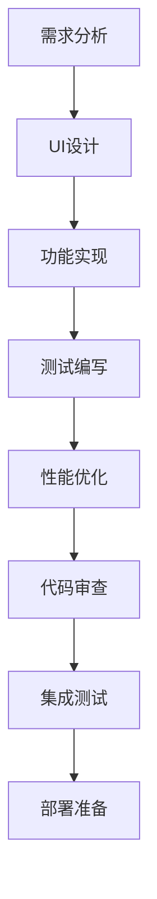

# Agent协作配置

## 协作概览

这个在线闹钟项目采用多Agent协作模式，每个Agent专注于特定领域，通过标准化的工作流程和协作协议确保高质量的代码产出。

## Agent角色定义

### 1. Frontend Developer Agent (主开发Agent)

**专业领域**: React应用开发、TypeScript、业务逻辑实现
**权限级别**: 完整项目读写权限
**主要职责**:

- React组件开发和重构
- TypeScript类型定义和接口设计
- 业务逻辑实现和数据流管理
- API集成和状态管理
- 路由配置和页面结构

**工作模式**:

```bash
# 开发前环境检查
npm run lint           # 代码规范检查
npm run test:run       # 确保现有测试通过

# 开发过程
npm run dev            # 启动开发环境
# 实时开发和测试

# 完成后验证
npm run test           # 运行相关测试
npm run build          # 验证构建成功
```

**代码审查标准**:

- TypeScript类型覆盖率100%
- 遵循React最佳实践
- 组件复用性和可维护性
- 性能考虑 (避免不必要的重渲染)

### 2. UI/UX Designer Agent

**专业领域**: 界面设计、用户体验、视觉设计
**权限级别**: 样式文件和UI组件读写权限
**主要职责**:

- Tailwind CSS样式开发
- DaisyUI组件定制和主题设计
- 响应式布局实现
- 动画效果设计和优化
- 用户交互体验优化

**设计系统规范**:

```css
/* 色彩系统 */
--primary: #3B82F6      /* 主色调 - 蓝色 */
--secondary: #8B5CF6    /* 辅色调 - 紫色 */
--accent: #10B981       /* 强调色 - 绿色 */
--neutral: #374151      /* 中性色 - 深灰 */
--base-100: #FFFFFF     /* 背景色 - 白色 */

/* 间距系统 (Tailwind默认) */
xs: 0.5rem (2px)
sm: 0.75rem (12px)
md: 1rem (16px) 
lg: 1.5rem (24px)
xl: 2rem (32px)

/* 断点系统 */
sm: 640px               /* 大型手机/小平板 */
md: 768px               /* 平板 */
lg: 1024px              /* 小型桌面 */
xl: 1280px              /* 标准桌面 */
2xl: 1536px             /* 大屏幕 */
```

**组件设计原则**:

- 移动端优先 (Mobile First)
- 高对比度和可访问性
- 一致的视觉语言
- 流畅的过渡动画

### 3. Test Engineer Agent

**专业领域**: 测试策略、质量保证、自动化测试
**权限级别**: 测试文件和测试配置读写权限
**主要职责**:

- 单元测试用例编写
- 组件测试和集成测试
- 钩子函数测试
- 测试覆盖率优化
- 测试工具配置和维护

**测试策略**:

```typescript
// 组件测试结构
describe('ComponentName', () => {
  // 渲染测试
  it('should render correctly', () => {
    // 基础渲染测试
  });
  
  // 交互测试
  it('should handle user interactions', () => {
    // 用户交互测试
  });
  
  // 边界条件测试
  it('should handle edge cases', () => {
    // 边界情况测试
  });
});
```

**测试覆盖目标**:

- 核心业务逻辑: 90%+
- UI组件: 80%+
- 工具函数: 95%+
- 钩子函数: 85%+

### 4. Performance Optimizer Agent

**专业领域**: 性能优化、构建优化、监控分析
**权限级别**: 构建配置和性能相关代码读写权限
**主要职责**:

- Vite构建配置优化
- 代码分割策略制定
- 资源加载优化
- 性能瓶颈分析
- 监控指标集成

**优化检查清单**:

```bash
# 构建分析
npm run build          # 构建并检查大小（超过500KB会警告）

# 性能指标目标
- First Contentful Paint < 1.5s
- Largest Contentful Paint < 2.5s  
- Cumulative Layout Shift < 0.1
- First Input Delay < 100ms
```

**优化策略**:

- 代码分割: 页面级 + 库级分割
- 资源优化: 图片压缩、懒加载
- 缓存策略: 合理的缓存配置
- 包大小控制: 单个chunk < 500KB

## 协作工作流程

### 1. 功能开发流程



#### 详细步骤

**阶段1: 需求分析和设计**

```bash
# UI/UX Designer Agent 主导
1. 分析用户需求和设计要求
2. 创建组件设计稿和交互规范
3. 确定技术实现方案
```

**阶段2: 功能实现**

```bash
# Frontend Developer Agent 主导
1. 根据设计创建React组件
2. 实现业务逻辑和状态管理
3. 集成API和数据处理
4. 确保TypeScript类型安全

# 实时协作检查
npm run dev            # 开发环境验证
npm run lint           # 代码规范检查
```

**阶段3: 测试编写**

```bash
# Test Engineer Agent 主导
1. 编写单元测试用例
2. 添加组件交互测试
3. 集成测试验证
4. 测试覆盖率检查

npm run test           # 交互式测试
npm run test:coverage  # 覆盖率报告
```

**阶段4: 性能优化**

```bash
# Performance Optimizer Agent 主导
1. 构建大小分析
2. 运行时性能优化
3. 资源加载优化
4. 性能指标验证

npm run build          # 构建验证和性能检查
```

### 2. 问题修复流程

```bash
1. 问题识别和分析
   - 复现问题场景
   - 确定影响范围
   - 分析根本原因

2. 协作修复
   - Frontend: 业务逻辑修复
   - UI/UX: 界面问题修复  
   - Test: 测试用例补充
   - Performance: 性能影响评估

3. 验证和部署
   npm run lint -- --fix # 快速修复
   npm run test && npm run build # 完整验证
```

### 3. 代码审查标准

#### Frontend Code Review

```typescript
// ✅ 好的实践
interface Props {
  title: string;
  isActive?: boolean;
  onAction?: () => void;
}

const Component: React.FC<Props> = ({ 
  title, 
  isActive = false, 
  onAction 
}) => {
  return (
    <div className="component-container">
      {/* 清晰的JSX结构 */}
    </div>
  );
};

export default Component;
```

#### UI/UX Code Review

```css
/* ✅ 好的样式实践 */
.component {
  @apply 
    /* 布局 */
    flex items-center justify-between
    /* 尺寸 */  
    w-full h-12
    /* 间距 */
    px-4 py-2
    /* 外观 */
    bg-white rounded-lg shadow-sm
    /* 响应式 */
    md:h-14 md:px-6
    /* 交互 */
    hover:shadow-md transition-shadow;
}
```

#### 测试代码审查

```typescript
// ✅ 完整的测试用例
describe('TimerComponent', () => {
  beforeEach(() => {
    // 测试环境设置
  });

  it('should start timer correctly', async () => {
    render(<TimerComponent />);
    const startButton = screen.getByRole('button', { name: /start/i });
    
    await user.click(startButton);
    
    expect(startButton).toHaveTextContent('Stop');
    // 更多断言...
  });
});
```

## Agent间通信协议

### 1. 任务分配原则

- **单一职责**: 每个Agent专注自己的专业领域
- **明确边界**: 清楚定义各Agent的工作范围
- **协作优先**: 跨领域问题需要多Agent协作
- **质量第一**: 所有变更都需要经过相应的审查

### 2. 协作触发条件

- **新功能开发**: 所有Agent参与完整流程
- **Bug修复**: 根据问题性质确定参与的Agent
- **性能优化**: Performance + Frontend协作
- **UI改进**: UI/UX + Frontend协作
- **测试完善**: Test + 对应业务Agent协作

### 3. 冲突解决机制

```bash
# 代码冲突解决流程
1. 识别冲突点和影响范围
2. 相关Agent讨论解决方案
3. 制定统一的实现标准
4. 所有Agent遵循统一标准
5. 更新项目文档和最佳实践
```

## 质量门控标准

### 1. 提交前检查 (Pre-commit)

```bash
# 所有Agent都必须通过的检查
npm run lint           # 代码规范检查
npm run test:run       # 所有测试通过
npm run build          # 构建成功验证
```

### 2. 集成检查 (CI Pipeline)

```bash
# 自动化质量门控（可使用Claude Code命令）
/check                 # 快速检查：lint + test
/quality-check         # 全面检查：lint + test + build

# 或手动执行
npm run lint && npm run test:run && npm run build
```

### 3. 性能基准

- **构建时间**: < 30秒
- **测试执行时间**: < 60秒
- **Bundle大小**: < 500KB (警告阈值)
- **首屏加载时间**: < 2秒

## 最佳实践指南

### 1. 代码组织

```typescript
// 文件命名规范
ComponentName.tsx       // 组件文件
ComponentName.test.tsx  // 测试文件
ComponentName.stories.tsx // Storybook文件 (如果使用)
useCustomHook.ts       // 钩子文件
utils.ts               // 工具函数
types.ts               // 类型定义
```

### 2. 提交信息规范

```bash
# 提交类型前缀
feat: 新功能
fix: 修复bug  
docs: 文档更新
style: 样式修改 (不影响代码逻辑)
refactor: 重构 (既不是新功能也不是修复)
test: 测试相关
chore: 构建过程或辅助工具变动
perf: 性能优化

# 示例
git commit -m "feat(timer): add pause and resume functionality"
git commit -m "fix(ui): correct responsive layout on mobile"
git commit -m "test(alarm): add unit tests for alarm scheduling"
```

### 3. 文档维护

- **组件文档**: JSDoc注释 + README
- **API文档**: 接口定义和使用示例
- **测试文档**: 测试策略和覆盖率报告
- **部署文档**: 部署流程和环境配置

## 监控和改进

### 1. 协作效果指标

- **开发效率**: 功能完成时间
- **代码质量**: 缺陷率、测试覆盖率
- **协作效率**: Agent间沟通成本
- **用户满意度**: 功能可用性和性能

### 2. 持续改进

```bash
# 定期评估和优化
1. 每周协作效果回顾
2. 流程瓶颈识别和优化
3. 工具链升级和改进
4. 最佳实践更新和分享
```

### 3. 知识管理

- **经验总结**: 定期整理开发经验
- **问题库**: 常见问题和解决方案
- **最佳实践**: 持续更新实践指南
- **技术分享**: Agent间技术知识共享

---

## 总结

这个Agent协作配置旨在:

1. **提高效率**: 专业化分工，减少重复工作
2. **保证质量**: 多层次审查，标准化流程  
3. **降低风险**: 完善的测试和验证机制
4. **促进协作**: 清晰的协作协议和沟通机制

通过这种协作模式，我们能够在保证代码质量的同时，最大化开发效率，创造出色的用户体验。
